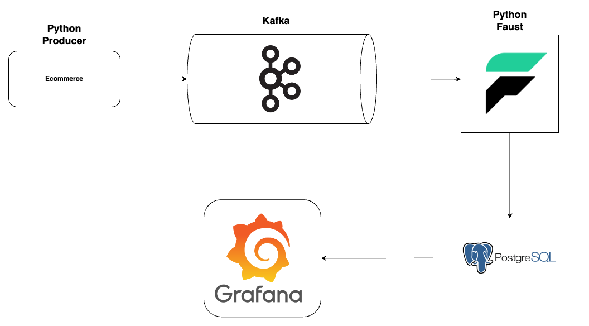
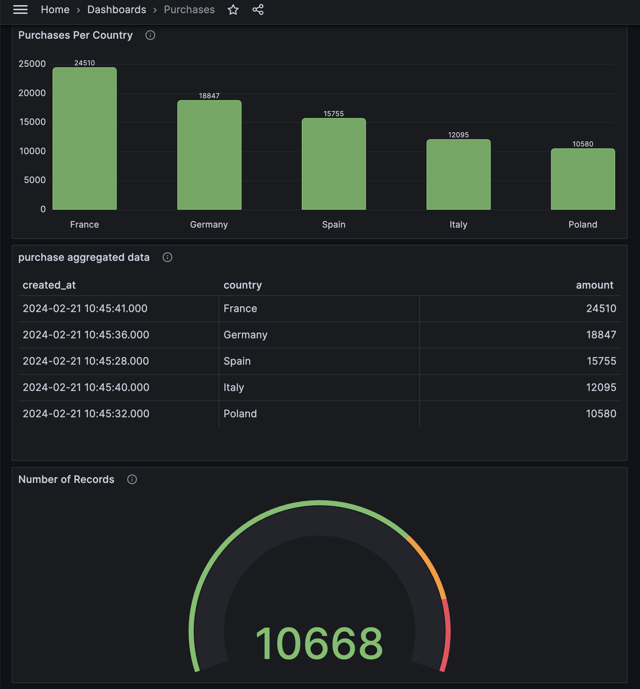

## Introduction

This is a simple data processing pipeline that can handle streaming data, aggregate it with a window function, store it in a database, and visualise it.

**Application Scenario**
- The use case involves simulating purchasing data sourced from an ecommerce store.
- The generated data is streamed to Kafka.
- Utilizing a Python Faust app, the data is processed and aggregated using a tumbling window function.
- Persisting the aggregated data into a Postgres database.
- Ultimately, visualizing the purchase volume categorized by country using Grafana.





---
### Tech Stack


- **Python** as our programming language.
- **kafka** as our distributed event store.
- **confluent-kafka-python** as our Python Kafka Client.
- **Faust** as our stream processing library.
- **Faker** for simulating the data generation.
- **PostgreSQL** as our database of choice.
- **grafana** For Interactive Data Visualization.
- **Docker, Docker Compose** for Application Containerization.

---

### Project Structure
```sh
.
├── README.md
├── consumer
│   ├── Dockerfile
│   ├── __init__.py
│   ├── consumer.py
│   ├── database.py
│   └── requirements.txt
├── docker-compose.yml
├── grafana-data
└── producer
    ├── Dockerfile
    ├── __init__.py
    ├── models.py
    ├── producer.py
    └── requirements.txt
```
---
## Quick start

1. open a terminal and run
```shell
docker-compose up --build
```
2. Navigate to [grafana UI](http://localhost:3000/)
    * use username=`admin`, password=`admin`, then update the password as you want.
    * Click on Dashboards, and select the `Purchases` dashboard.
    * You will see an interactive dashboard updated per minute (feel free to update the time window in grafana and in faust app).




- **Please note**:
<ins>I included the grafana data with app, so the dashboards will be automatically created and populated with data.
And you won't need to manually do anything but I will write the steps here for reference:</ins>
    - Add a data source to connect to postgres
        - Host URL: `postgres_db:5432`
        - Database name: `grafana`
        - Username: `grafana_user`
        - password: `1234`
        - TLS/SSL Mode: disable
        - Save and test.
    - Create Dashboard, use the following query for the most updated version of aggregated data
        ```sql
        SELECT * 
        FROM (
            SELECT 
            *,
            ROW_NUMBER() OVER(PARTITION BY country ORDER BY created_at DESC) AS row_number

            FROM purchase_summmary
            )
        WHERE row_number = 1
        ORDER BY amount DESC;
        ```

---
